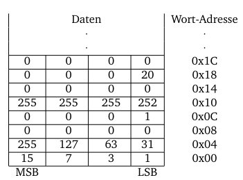

---
# try also 'default' to start simple
theme: seriph
# random image from a curated Unsplash collection by Anthony
# like them? see https://unsplash.com/collections/94734566/slidev
background: https://cover.sli.dev
# some information about your slides (markdown enabled)
title: Übung1
info: |
  ## RO Übung 1
# apply UnoCSS classes to the current slide
class: text-center
# https://sli.dev/features/drawing
drawings:
  persist: false
# slide transition: https://sli.dev/guide/animations.html#slide-transitions
transition: slide-left
# enable Comark Syntax: https://comark.dev/syntax/markdown
comark: true
# duration of the presentation
duration: 90min
addons:
# - fancy-arrow
#- cpp-runner
# - tldraw
# - typst
# - window-mockup
# - slidev-component-zoom
 - vuetify
 - "@katzumi/slidev-addon-qrcode"
---

# Gruppenübung 1
## Assembler & Speicher

---
clicks: 8
---

# Aufgabe 1.1 - Theoriefragen {class=title-accent}

<AnimatedList class="letter-list">
<!--a)-->
<AnimatedListEntry when="current % 2 === 0 || current === 0 * 2 + 1">

Wofür stehen die Abkürzungen _RISC_ und _CISC_?  
__Nennen Sie Vor- und Nachteile einer _RISC_-Architektur.__
</AnimatedListEntry>

<!--b)-->
<AnimatedListEntry when="current % 2 === 0 || current === 1 * 2 + 1">

Gegeben sei ein Wort-adressierter Speicher.
__Wie viele Wörter lassen sich maximal adressieren, wenn die Adresse vier Byte groß ist?__
</AnimatedListEntry>

<!--c)-->
<AnimatedListEntry when="current % 2 === 0 || current === 2 * 2 + 1">

Was unterscheidet einen __logischen Rechtsshift__ von einem __arithmetischen Rechtsschift__?
</AnimatedListEntry>

<!--d)-->
<AnimatedListEntry when="current % 2 === 0 || current === 3 * 2 + 1">

Mit I-Typ Befehlen können __12 bit__ Direktwerte (Immediates) verwendet werden.  
__Wie können auch größere Konstanten im Programm verwendet werden?__
</AnimatedListEntry>


<!--lösung a)-->
<AnimatedListEntry style="list-style-type: none; !important" when="current === 0 * 2 + 1">
<v-card
  subtitle="1.1a"
  width="100%"
>
<template v-slot:prepend><v-icon><div class="i-streamline-plump-color:class-lesson-flat"></div></v-icon></template>
<template v-slot:title><span>Musterlösung</span></template>
<v-card-text>

__RISC__ steht für _Reduced Instruction Set Computing_  
__CISC__ steht für _Complex Instruction Set Computing_  

Vorteile:
- Hardware Entwurf einfacher durch einfachere Instruktionen.
- Schnellere Ausführung einzelner Instruktionen, da weniger Instruktionen optimiert werden müssen.

<br>Nachteile:
- Benötigt mehr Instruktionen für dieselbe Aufgabe (und mehr Programmspeicher)  
</v-card-text>
</v-card>
</AnimatedListEntry>

<!--lösung b)-->
<AnimatedListEntry style="list-style-type: none; !important" when="current === 1 * 2 + 1">
<v-card
  subtitle="1.1b"
  width="100%"
>
<template v-slot:prepend><v-icon><div class="i-streamline-plump-color:class-lesson-flat"></div></v-icon></template>
<template v-slot:title><span>Musterlösung</span></template>
<v-card-text>

$2^{32} = 4294967296$
</v-card-text>
</v-card>
</AnimatedListEntry>

<!--lösung c)-->
<AnimatedListEntry style="list-style-type: none; !important" when="current === 2 * 2 + 1">
<v-card
  subtitle="1.1c"
  width="100%"
>
<template v-slot:prepend><v-icon><div class="i-streamline-plump-color:class-lesson-flat"></div></v-icon></template>
<template v-slot:title><span>Musterlösung</span></template>
<v-card-text>

Bei logischen Rechtsshifts werden die linksseitigen Bits mit 0 aufgefüllt.
Bei arithmetischen Rechtsshifts werden die linksseitigen Bits mit dem Wert des Most Significant Bit (msb) aufgefüllt. Somit bleibt bei Zahlen, die als Zweier-Komplement dargestellt sind, das Vorzeichen erhalten.
</v-card-text>
</v-card>
</AnimatedListEntry>

<!--lösung d) -->
<AnimatedListEntry style="list-style-type: none; !important" when="current === 3 * 2 + 1">
<v-card
  subtitle="1.1d"
  width="100%"
>
<template v-slot:prepend><v-icon><div class="i-streamline-plump-color:class-lesson-flat"></div></v-icon></template>
<template v-slot:title><span>Musterlösung</span></template>
<v-card-text>

Durch das Nutzen der Instruktionen _lui_ und _addi_ können beliebige __32 bit__ Werte mit 2 Befehlen geladen werden

```riscv
lui t0, value[31:12] # lade obere 20 bit
addi t0, t0, value[11:0] # lade untere 12 bit
li t0, value # Pseudo-Instruktion li wird im Hintergrund durch die beiden oberen Instruktionen ersetzt
```
</v-card-text>
</v-card>
</AnimatedListEntry>
</AnimatedList>

---

# 1.2 Assembler- und Maschinensprache {class=title-accent}

<div grid=" rows-2">
<div grid="~ cols-[1fr_auto]">
<div class="" >
<div>
<ul class=letter-list>
<li>
<code class="width-500" v-mark.box.red="1">add t0, a6, t2</code>
<code v-click="2" style="margin-left:0.7em; font-size:0.6em">000000 00111 10000 000 00101<code class="color-red">0110011</code></code>
</li>
<li>
<code class="width-500" v-mark.box.orange="3">ori s0, t2, 10</code>
<code v-click="4" style="margin-left:0.7em; font-size:0.6em">00000001010 00111 110 01000<code class="color-orange">0010011</code></code>
</li>
<li>
<code class="width-500" v-mark.box.yellow="5">sw a4, 8(t0)</code>
<code v-click="6" style="margin-left:0.7em; font-size:0.6em">000000 01110 00101 010 01000<code class="color-yellow">0100011</code></code>
</li>
<li>
<code class="width-500" v-mark.box.green="7">jal ra, 32</code>
<code v-click="8" style="margin-left:0.7em; font-size:0.6em">00000010000000000000 00001<code class="color-green">1101111</code></code>
</li>
<li>
<code class="width-500" v-mark.box.cyan="10">li t3, 4097</code>
<p class="absolute left-50 top-53"><code v-click="11" style="margin-left:0.7em; font-size:0.6em">00000000000000000001 11100<code class="color-cyan">0110111</code></code></p>
<p class="absolute left-50 top-58"><code v-click="9" style="margin-left:0.7em; font-size:0.6em">000000000001 11100 000 11100<code class="color-orange">0010011</code></code></p>
</li>
</ul>
</div>

</div>
<div class="decreased-line-height">

<table v-click="1">
<thead >
<tr>
<td>opcode</td>
<td>funct3</td>
<td>funct7</td>
<td>Type</td>
<td>Instruction</td>
</tr>
</thead>
<tbody>
<tr>
<td><code>0110011</code></td>
<td><code>000</code></td>
<td><code>0000000</code></td>
<td>R</td>
<td v-mark.underline.red="1" style="font-size:0.8em">add rd, rs1, rs2</td>
</tr>
<tr v-click="3">
<td><code>0010011</code></td>
<td><code>110</code></td>
<td></td>
<td>I</td>
<td v-mark.underline.orange="3" style="font-size:0.8em">ori rd, rs1, imm</td>
</tr>
<tr v-click="5">
<td><code>0100011</code></td>
<td><code>010</code></td>
<td></td>
<td>S</td>
<td v-mark.underline.yellow="5" style="font-size:0.8em">sw rs2, imm(rs1)</td>
</tr>
<tr v-click="7">
<td><code>1101111</code></td>
<td></td>
<td></td>
<td>J</td>
<td v-mark.underline.green="7" style="font-size:0.8em">jal rd, label</td>
</tr>
<tr v-click="10">
<td><code>0110111</code></td>
<td></td>
<td></td>
<td>U</td>
<td v-mark.underline.cyan="10" style="font-size:0.8em">lui rd, upimm</td>
</tr>
</tbody>
</table>

</div>
</div>
<div class="flex justify-center">
<div class="decreased-line-height">
<br/>

| 31 - 25 | 24 - 20 | 19 - 15 | 14 - 12 | 11 - 7 | 6 - 0 |  |
|---------|---------|---------|---------|--------|-------|--|
|funct7|rs2|rs1|funct3|rd|opcode| <span >R-Type</span> |
|imm 11:0||rs1|funct3|rd|opcode| I-Type |
|imm 11:5|rs2|rs1|funct3|imm 4:0|opcode| S-Type |
|imm 12,10:5|rs2|rs1|funct3|imm 4:1,11|opcode| B-Type |
|imm 31:12||||rd|opcode| U-Type |
|imm 20,10:1,11,19:12||||rd|opcode| J-Type |

</div>
</div>
</div>

<style>
  .decreased-line-height table {
    line-height:0em !important;
  }
</style>

---

# 1.2 Assembler- und Maschinensprache {class=title-accent}

<div grid=" rows-2">
<div grid="~ cols-[1fr_auto]">
<div class="" >
<div>
<ul class=letter-list style="font-size:0.85em">
<li>
<code class="width-500" v-mark.box.red="1">01000000_00000001_00100011_00000011</code>
<code v-click="2" style="margin-left:0.7em; font-size:0.75em"><code class="color-red">lw</code> t1, 1024(sp)</code>
</li>
<li>
<code class="width-500" v-mark.box.orange="3">00000000_00000000_00000000_00010011</code>
<code v-click="4" style="margin-left:0.7em; font-size:0.75em"><code class="color-orange">addi</code> x0, x0, 0</code>
</li>
<li>
<code class="width-500" v-mark.box.yellow="5">00000000_10010100_00000110_01100011</code>
<code v-click="6" style="margin-left:0.7em; font-size:0.75em"><code class="color-yellow">beq</code> s0, s1, 12</code>
</li>
<li>
<code class="width-500" v-mark.box.green="7">00000000_01010101_01010101_00110111</code>
<code v-click="8" style="margin-left:0.7em; font-size:0.75em"><code class="color-green">lui</code> a0, 1365</code>
</li>
<li>
<code class="width-500" v-mark.box.cyan="9">00000011_00000000_00000000_01101111</code>
<code v-click="10" style="margin-left:0.7em; font-size:0.75em"><code class="color-cyan">jal</code> x0, 48</code>
</li>
</ul>
</div>

</div>
<div class="decreased-line-height">

<table v-click="1">
<thead >
<tr>
<td>opcode</td>
<td>funct3</td>
<td>funct7</td>
<td>Type</td>
<td>Instruction</td>
</tr>
</thead>
<tbody>
<tr>
<td><code>0000011</code></td>
<td><code>010</code></td>
<td></td>
<td>I</td>
<td v-mark.underline.red="1" style="font-size:0.8em">lw rd, imm(rs1)</td>
</tr>
<tr v-click="3">
<td><code>0010011</code></td>
<td><code>000</code></td>
<td></td>
<td>I</td>
<td v-mark.underline.orange="3" style="font-size:0.8em">addi rd, rs1, imm</td>
</tr>
<tr v-click=5>
<td><code>1100011</code></td>
<td><code>000</code></td>
<td></td>
<td>B</td>
<td v-mark.underline.yellow="5" style="font-size:0.8em">beq rs1, rs2, label</td>
</tr>
<tr v-click="7">
<td><code>0110111</code></td>
<td></td>
<td></td>
<td>U</td>
<td v-mark.underline.green="7" style="font-size:0.8em">lui rd, upimm</td>
</tr>
<tr v-click="9">
<td><code>1101111</code></td>
<td></td>
<td></td>
<td>J</td>
<td v-mark.underline.cyan="9" style="font-size:0.8em">jal rd, label</td>
</tr>
</tbody>
</table>

</div>
</div>
<div class="flex justify-center">
<div class="decreased-line-height">
<br/>

| 31 - 25 | 24 - 20 | 19 - 15 | 14 - 12 | 11 - 7 | 6 - 0 |  |
|---------|---------|---------|---------|--------|-------|--|
|funct7|rs2|rs1|funct3|rd|opcode| <span >R-Type</span> |
|imm 11:0||rs1|funct3|rd|opcode| I-Type |
|imm 11:5|rs2|rs1|funct3|imm 4:0|opcode| S-Type |
|imm 12,10:5|rs2|rs1|funct3|imm 4:1,11|opcode| B-Type |
|imm 31:12||||rd|opcode| U-Type |
|imm 20,10:1,11,19:12||||rd|opcode| J-Type |

</div>
</div>
</div>

<style>
  
</style>

---
clicks: 28
---
# Aufgabe 1.3 Assemblerprogrammierung {class=title-accent}
### Unteraufgabe a)

<div grid="~ cols-2">
<div>
<ul class="letter-list">
<li :class="($clicks === 0 || ($clicks > 0 && $clicks < 2)) ? 'opacity-100' : 'opacity-30'">
<code>c = 100;</code>
</li>
<li :class="($clicks === 0 || ($clicks > 1 && $clicks < 3)) ? 'opacity-100' : 'opacity-30'">
<code>a = a + 1;</code>
</li>
<li :class="($clicks === 0 || ($clicks > 2 && $clicks < 6)) ? 'opacity-100' : 'opacity-30'">
<code>a = b - c - 1;</code>
</li>
<li :class="($clicks === 0 || ($clicks > 5 && $clicks < 9)) ? 'opacity-100' : 'opacity-30'">
<code>b = (b | 42) + c;</code>
</li>
<li :class="($clicks === 0 || ($clicks > 8 && $clicks < 13)) ? 'opacity-100' : 'opacity-30'">
<code>e = b >= (c + 5);</code>
</li>
<li :class="($clicks === 0 || ($clicks > 12 && $clicks < 16)) ? 'opacity-100' : 'opacity-30'">
<code>c = b + 123456;</code>
</li>
<li :class="($clicks === 0 || ($clicks > 15 && $clicks < 19)) ? 'opacity-100' : 'opacity-30'">
<code>a = b & c & d;</code>
</li>
<li :class="($clicks === 0 || ($clicks > 18 && $clicks < 24)) ? 'opacity-100' : 'opacity-30'">
<code>b = b << (5 + 3);</code>
</li>
<li :class="($clicks === 0 || ($clicks > 23)) ? 'opacity-100' : 'opacity-30'">
<code>d = (e == 0) ? c : (c + 1);</code>
</li>
</ul>
</div>
<div>

<div v-if="$clicks === 1">

```riscv
addi a3, zero, 100 # c = 100
```
</div>
<div v-if="$clicks === 2">

```riscv
addi a1, a1, 1 # a = a + 1
```
</div>
<div v-if="$clicks > 2 && $clicks < 6">

```riscv {*|1|2}{at:4}
sub t0, a2, a3 # t0 = b - c
addi a1, t0, -1 # a = t0 - 1
```
</div>
<div v-if="$clicks > 5 && $clicks < 9">

```riscv {*|1|2}{at:7}
ori t0, a2, 42 # t0 = b | 42
add a2, t0, a3 # b = t0 + c
```
</div>
<div v-if="$clicks > 8 && $clicks < 13">

```riscv {*|1|2|3}{at:10}
addi t0, a3, 5 # t0 = c + 5
slt t0, a2, t0 # b = t0 < b
xor a5, t0, 1 # e = ~t0
```
</div>
<div v-if="$clicks > 12 && $clicks < 16">

```riscv {*|1|2}{at:14}
li t0, 123456 # t0 = 123456 (lui+addi)
add a3, a2, t0 # c = b + t0
```
</div>
<div v-if="$clicks > 15 && $clicks < 19">

```riscv {*|1|2}{at:17}
and t0, a2, a3 # t0 = b & c
and a1, t0, a4 # a = t0 & d
```
</div>
<div v-if="$clicks > 18 && $clicks < 24">

```riscv {*|1|2|3|4}{at:20}
addi t0, zero, 5 # t0 = 5
addi t1, zero, 3 # t1 = 3
add t2, t0, t1 # t2 = t0 + t1
sll a2, a2, t2 # b = b << t2
```
</div>
<div v-if="$clicks > 23">

```riscv {*|1,4,|5|2|3,6}{at:25}
bne a5, zero, label1 # jump if e == 0
add a4, a3, zero # d = c
jal zero, label2 # jump to end
label1:
addi a4, a3, 1 # d = c + 1
label2:
```
</div>
</div>
</div>

---

# Aufgabe 1.3 Assemblerprogrammierung {class=title-accent}
<div grid="~ cols-2">
<div>

### Unteraufgabe b) 1.


</div>
<div grid="~ rows-[1fr_auto]">
<div>
```riscv {*|1|2|3|4|5|6|7|8|*}
lw a0, 0x00(zero)
sb a0, 0x03(zero)
srli a0, a0, 8
sb a0, 0x02(zero)
srli a0, a0, 8
sb a0, 0x01(zero)
srli a0, a0, 8
sb a0, 0x00(zero)
```
</div>
<div class="decreased-line-height">
<table v-click=1>
<thead>
<tr>
<td>Instruktion</td>
<td>Ziel</td>
</tr>
</thead>
<tbody>
<tr v-click=1>
<td><code>lw a0, 0x00(zero)</code></td>
<td><code>a0 = 0x0f070301</code></td>
</tr>
<tr v-click=2>
<td><code>sb a0, 0x03(zero)</code></td>
<td><code>mem[0x03] = 1</code></td>
</tr>
<tr v-click=3>
<td><code>srli a0, a0, 8</code></td>
<td><code>a0 = 0x000f0703</code></td>
</tr>
<tr v-click=4>
<td><code>sb a0, 0x02(zero)</code></td>
<td><code>mem[0x02] = 3</code></td>
</tr>
<tr v-click=5>
<td><code>srli a0, a0, 8</code></td>
<td><code>a0 = 0x00000f07</code></td>
</tr>
<tr v-click=6>
<td><code>sb a0, 0x01(zero)</code></td>
<td><code>mem[0x01] = 7</code></td>
</tr>
<tr v-click=7>
<td><code>srli a0, a0, 8</code></td>
<td><code>a0 = 0x0000000f</code></td>
</tr>
<tr v-click=8>
<td><code>sb a0, 0x00(zero)</code></td>
<td><code>mem[0x00] = 15</code></td>
</tr>
</tbody>
</table>
</div>
</div>
</div>

---

# Aufgabe 1.3 Assemblerprogrammierung {class=title-accent}
<div grid="~ cols-2">
<div>

### Unteraufgabe b) 2.


</div>
<div grid="~ rows-[1fr_auto]">
<div>
```riscv {*|1|2|3|4|5|6|7|*}
addi t0, zero, 4
lw a0, 0x14(t0)
lb a2, 0x03(t0)
sw a2, 0x00(a0)
addi a3, a2, 13
lw s0, 0x00(a3)
sw zero, 0x04(a3)
```
</div>
<div class="decreased-line-height">
<table v-click=1>
<thead>
<tr>
<td>Instruktion</td>
<td>Ziel</td>
</tr>
</thead>
<tbody>
<tr v-click=1>
<td><code>addi t0, zero, 4</code></td>
<td><code>t0 = 4</code></td>
</tr>
<tr v-click=2>
<td><code>lw a0, 0x14(t0)</code></td>
<td><code>a0 = 20</code></td>
</tr>
<tr v-click=3>
<td><code>lb a2, 0x03(t0)</code></td>
<td><code>a2 = -1</code></td>
</tr>
<tr v-click=4>
<td><code>sw a2, 0x00(a0)</code></td>
<td><code>mem[0x14..0x17] = 155</code></td>
</tr>
<tr v-click=5>
<td><code>addi a3, a2, 13</code></td>
<td><code>a3 = 12</code></td>
</tr>
<tr v-click=6>
<td><code>lw s0, 0x00(a3)</code></td>
<td><code>s0 = 1</code></td>
</tr>
<tr v-click=7>
<td><code>sw zero, 0x04(a3)</code></td>
<td><code>mem[0x10..0x13] = 0</code></td>
</tr>
</tbody>
</table>
</div>
</div>
</div>

---

# Aufgabe 1.3 Assemblerprogrammierung {class=title-accent}
<div grid="~ cols-[13em_auto]">
<div>

### Unteraufgabe c) 1.

```riscv {*|1|2|4,7|5|6,3|4,7|5|6,3|4,7|5|6,3|4,7|8|*}
addi t1, zero, 7
addi t0, zero, 1
start:
blt t1, t0, end
add t0, t0, t0
jal zero, start
end:
srli t0, t0, 1
```
</div>
<div class="decreased-line-height" style="margin-left:1em;">
<table>
<thead>
<tr>
<td>Takt</td>
<td>Instruktion</td>
<td>Zielregister</td>
<td>Neuer Programmzähler</td>
</tr>
</thead>
<tbody>
<tr v-click=1>
<td>0</td>
<td><code>addi t0, zero, 4</code></td>
<td><code>t1 = 7</code></td>
<td>4</td>
</tr>
<tr v-click=2>
<td>1</td>
<td><code>addi t0, zero, 1</code></td>
<td><code>t0 = 1</code></td>
<td>8</td>
</tr>
<tr v-click=3>
<td>2</td>
<td><code>blt t1, t0, end </code></td>
<td></td>
<td>12</td>
</tr>
<tr v-click=4>
<td>3</td>
<td><code>add t0, t0, t0</code></td>
<td><code>t0 = 2</code></td>
<td>16</td>
</tr>
<tr v-click=5>
<td>4</td>
<td><code>jal zero, start</code></td>
<td></td>
<td>8</td>
</tr>
<tr v-click=6>
<td>5</td>
<td><code>blt t1, t0, end</code></td>
<td></td>
<td>12</td>
</tr>
<tr v-click=7>
<td>6</td>
<td><code>add t0, t0, t0</code></td>
<td><code>t0 = 4</code></td>
<td>16</td>
</tr>
<tr v-click=8>
<td>7</td>
<td><code>jal zero, start</code></td>
<td></td>
<td>8</td>
</tr>
<tr v-click=9>
<td>8</td>
<td><code>blt t1, t0, end</code></td>
<td></td>
<td>12</td>
</tr>
<tr v-click=10>
<td>9</td>
<td><code>add t0, t0, t0</code></td>
<td><code>t0 = 8</code></td>
<td>16</td>
</tr>
<tr v-click=11>
<td>10</td>
<td><code>jal zero, start </code></td>
<td></td>
<td>8</td>
</tr>
<tr v-click=12>
<td>11</td>
<td><code>blt t1, t0, end</code></td>
<td></td>
<td>20</td>
</tr>
<tr v-click=13>
<td>12</td>
<td><code>srli t0, t0, 1</code></td>
<td><code>t0 = 4</code></td>
<td>24</td>
</tr>
</tbody>
</table>
</div>
</div>

---

# Aufgabe 1.3 Assemblerprogrammierung {class=title-accent}
<div grid="~ cols-[13em_auto]">
<div>

### Unteraufgabe c) 2.

```riscv {*|1|2|4,7|5|6|4,7|5|6|4,7|8|9,3|*}
addi a0, zero, 12
addi a1, zero, 8
label1:
bge a1, a0, label2
sub a0, a0, a1
jalr zero, a1, 0
label2:
sub a1, a1, a0
bne a1, zero, label1
```
</div>
<div class="decreased-line-height" style="margin-left:1em;">
<table>
<thead>
<tr>
<td>Takt</td>
<td>Instruktion</td>
<td>Zielregister</td>
<td>Neuer Programmzähler</td>
</tr>
</thead>
<tbody>
<tr v-click=1>
<td>0</td>
<td><code>addi a0, zero</code></td>
<td><code>a0 = 12</code></td>
<td>4</td>
</tr>
<tr v-click=2>
<td>1</td>
<td><code>addi a1, zero</code></td>
<td><code>a1 = 8</code></td>
<td>8</td>
</tr>
<tr v-click=3>
<td>2</td>
<td><code>bge a1, a0, label2</code></td>
<td></td>
<td>12</td>
</tr>
<tr v-click=4>
<td>3</td>
<td><code>sub a0, a0, a1</code></td>
<td><code>a0 = 4</code></td>
<td>16</td>
</tr>
<tr v-click=5>
<td>4</td>
<td><code>jalr zero, a1</code></td>
<td></td>
<td>8</td>
</tr>
<tr v-click=6>
<td>5</td>
<td><code>bge a1, a0, label2</code></td>
<td></td>
<td>20</td>
</tr>
<tr v-click=7>
<td>6</td>
<td><code>sub a1, a1, a0</code></td>
<td><code>a1 = 4</code></td>
<td>24</td>
</tr>
<tr v-click=8>
<td>7</td>
<td><code>bne a1, zero, label1</code></td>
<td></td>
<td>8</td>
</tr>
<tr v-click=9>
<td>8</td>
<td><code>bge a1, a0, label2</code></td>
<td></td>
<td>20</td>
</tr>
<tr v-click=10>
<td>9</td>
<td><code>sub a1, a1, a0</code></td>
<td><code>a1 = 0</code></td>
<td>24</td>
</tr>
<tr v-click=11>
<td>10</td>
<td><code>bne a1, zero, label1</code></td>
<td></td>
<td>28</td>
</tr>
</tbody>
</table>
</div>
</div>

---

# Kontakt Für Fragen & co. {class=title-accent}
<div class="flex">
<QRCode
  value="https://discord.gg/geekhub"
  :width="180"
  :height="180"
  color="234253"
  image="./imgs/geekhub.png"
  class="bg-#aaaacc rounded-xl"
/>
<p class="text-2xl" style="padding-left:3em; padding-top:1em"><-- Geekhub</p>


 {class="absolute right-30 top-20" style="width: 200px"}

</div>

<div class="flex">
<div style="padding-top:2em">

**DISCORD:** `luh3119`
</div>
<p class="text-2xl" style="padding-left:3.5em; padding-top:1.5em"><-- Ich</p>
</div>